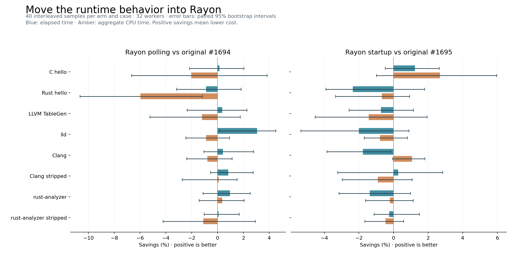

# Rayon experiments for mold #1694 and #1695

Builds, tests and benchmarks ran on `ssh wx-workstation` on 6 October 2026. Each candidate starts at the original PR's exact head; the shared baseline is `99d79c429bda8630330c806b33ca724a770ac637`.

- **Idle polling:** moving the policy into Rayon gives no broad efficiency win over #1694. Across eight single-link cases, elapsed time changes by −0.63% and CPU time by +1.43% (equal-weight geometric means). Concurrent stripped-Clang links take 2.19% longer and use 6.10% more CPU.
- **Async startup:** performance stays close to #1695: +0.86% elapsed and +0.08% CPU across the eight cases. This version preserves Rayon's global pool. Its policy of aborting on a late worker-creation failure needs Rayon API review.

These are experimental patches to vendored rayon-core 1.13.0. Most small single-link differences are uncertain; the workstation also had unrelated build/VM activity. The averages describe these cases, not a production workload.

## Results

All entries below are medians in milliseconds. CPU is aggregate user + system time. Lower is better.

| Workload | #1694 elapsed | Rayon polling elapsed | #1694 CPU | Rayon polling CPU | #1695 elapsed | Rayon startup elapsed | #1695 CPU | Rayon startup CPU |
| --- | ---: | ---: | ---: | ---: | ---: | ---: | ---: | ---: |
| C hello | 6.81 | 6.80 | 98.64 | 100.66 | 6.92 | 6.84 | 86.62 | 84.29 |
| Rust hello | 13.06 | 13.17 | 258.82 | 274.30 | 13.45 | 13.76 | 194.00 | 195.32 |
| LLVM TableGen | 16.33 | 16.27 | 350.30 | 354.53 | 17.47 | 17.59 | 272.47 | 276.37 |
| lld | 78.61 | 76.20 | 1944.97 | 1962.22 | 78.94 | 80.52 | 1744.34 | 1757.96 |
| Clang | 122.25 | 121.74 | 3026.21 | 3050.08 | 125.93 | 128.17 | 2753.01 | 2723.54 |
| Clang stripped | 54.29 | 53.84 | 1343.90 | 1342.60 | 57.09 | 56.94 | 1101.01 | 1111.00 |
| rust-analyzer | 127.72 | 126.50 | 2898.64 | 2888.10 | 128.97 | 130.74 | 2391.14 | 2396.18 |
| rust-analyzer stripped | 111.78 | 111.69 | 2346.35 | 2372.10 | 113.81 | 114.09 | 1892.61 | 1901.44 |

Concurrent batches, median seconds; each link uses 32 workers on the same 32 physical cores:

| Batch | #1694 | Rayon polling | #1695 | Rayon startup |
| --- | ---: | ---: | ---: | ---: |
| 640 C hello, 32 at once | 0.3176 | 0.3255 | 0.3038 | 0.3128 |
| 48 Clang stripped, 8 at once | 1.5324 | 1.5660 | 1.5292 | 1.5300 |

## Method and validation

Threadripper PRO 9985WX, CPUs 32–63 (one hardware thread per physical core), 32 workers, warm inputs, ext4 output, `--no-fork`. Same toolchain and release flags for every arm. Single-link runs use three warmups and 40 cyclically interleaved samples per arm/case; concurrent batches use ten samples. The report also includes 1- and 8-worker checks, p95, RSS and paired 95% bootstrap intervals. Benchmarks held the shared workstation's exclusive lock.

Baseline and both candidates each passed 32 mold library tests, 2 harness library tests, and the native integration suite (503 passed, 14 skipped, 0 failed). The upstream Rayon suite and added tests passed. All eight captured outputs match byte-for-byte at 32 workers; three selected workloads also match at 1 and 8 workers. Other architectures were not tested.

## Evidence

- [Raw single-link samples](results/latency.json), [concurrent batches](results/throughput.json), [1-worker](results/threads1.json) and [8-worker](results/threads8.json) samples.
- [Derived results and confidence intervals](report/summary.json), [standalone HTML report](report/report.html) (download and open locally), [SVG chart](report/comparison.svg).
- [Source manifest](manifest.json), [protocol](PROTOCOL.txt), [machine fingerprint](results/fingerprint.txt), [build/test logs](logs), [output hashes](golden-hashes.json).
- [Measurement script](measure.py), [batch script](throughput.py), [analysis and plotting](analyze.py), [build/test commands](run-work.sh).
- [Raw phase profiles](results/phases.json). These use coarse internal timers with overlapping spans; do not sum them as independent CPU costs.
- [First polling revision](results-initial), retained separately. Its startup/nested-wait polling cost more CPU; the final version limits polling to completed top-level work. Do not compare absolute timings between separate batches.
- [Rayon polling source patch](rayon-idle-source.patch) and [startup source patch](rayon-startup-source.patch), relative to unmodified rayon-core 1.13.0.
- [Complete investigation archive](mold-rayon-experiments-20261006.zip), including the original dependency source and licenses. This is the frozen pre-publication snapshot; its local paths identify where artifacts were produced. Corpus inputs and binaries are not included.

The source commits measured were `e28a30fcc0acba52bb110cc8508d85deb1dacac6` (polling) and `bcf50b97220adbe47f510a97969c18429857b1f3` (startup). Later commits add documentation only. Original heads: `28d46ec70515269e1fff4aa39d178e8c07e260e4` (#1694), `6920f80dc4e2488b78b32dcf6ace9c32969dfd1a` (#1695).
