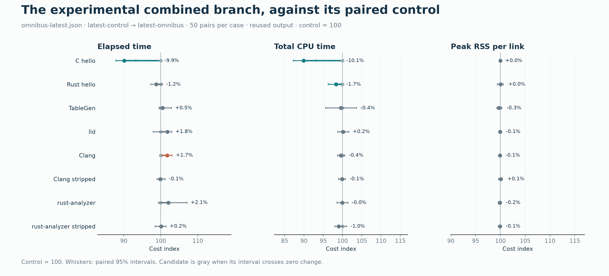
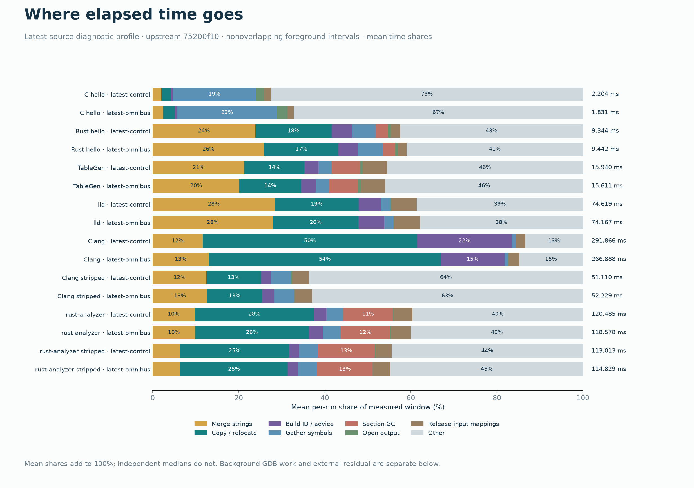

# Mold efficiency experiments — 6 October 2026

Sixteen independent experiments produced one reliable small-link improvement and one conditional large-link improvement. **P1, demand-sized symbol blocks, saves about 10–12% on C hello. H1, batched output mapping advice, reduces Clang wall time by 7.5% and total CPU by 20.2% in a later contended state when isolated against P1.** The primary 50-pair comparison also measured a **1.75% Clang wall-time regression** (95% interval +0.30% to +3.13%) in a cheaper state. Both results are retained. H1 is experimental; this is not a general large-link speedup.

The other fourteen ideas are excluded from the combined branch. Several traded less CPU or memory for slower links. All topic worktrees remain available, and [verified patches](patches/README.md) reproduce the investigated source trees without needing those local worktrees.

## Read the results

- [Self-contained visual report](report/report.html): download and open locally for the full report, expandable evidence, and every topic's wall/CPU/RSS results.
- [Topic decisions](topics/INDEX.md) and [latest combined results](topics/omnibus-latest.md).
- [Raw per-link samples](report-data/all-samples.csv), [per-group statistics](report-data/all-case-summary.csv), and [data definitions](report-data/README.md).
- [Latest phase attribution](profile-report/findings-latest.md), [kernel attribution](notes/h1-kernel-attribution.md), and [measurement protocol](PROTOCOL.md).

## Final combined comparison

Both binaries descend from upstream `75200f107ee958227e87a96e67ad491567a4854a`. Control `f1dec0f0` already includes PR #1696's thread selection and parallel GOT changes; combined source `8e522e52` adds P1 and H1. The later report commit changes documentation only. Each output mode has 50 interleaved pairs per case, three warmups, and warm inputs. Negative deltas mean less time. CPU is user+system time across all workers.

| Case | Control → combined, ms | Wall change [95% CI] | CPU change | Fresh-output wall change |
|---|---:|---:|---:|---:|
| C hello | 3.86 → 3.48 | -9.9% [-12.1, -6.8] | -10.1% | -11.7% |
| Rust hello | 11.67 → 11.53 | -1.2% [-2.7, +0.5] | -1.7% | +0.0% |
| TableGen | 18.01 → 18.10 | +0.5% [-0.5, +2.9] | -0.4% | +1.3% |
| lld, debug | 79.03 → 80.48 | +1.8% [-2.0, +3.0] | +0.2% | -1.4% |
| Clang, debug | 118.93 → 121.01 | +1.7% [+0.3, +3.1] | -0.4% | +2.7% |
| Clang, stripped | 55.02 → 54.96 | -0.1% [-1.0, +1.2] | -0.1% | -0.3% |
| rust-analyzer, debug | 129.05 → 131.75 | +2.1% [-0.6, +7.1] | -0.0% | +1.5% |
| rust-analyzer, stripped | 116.56 → 116.74 | +0.2% [-1.6, +1.4] | -1.0% | -1.2% |

The all-case table remains the primary result. The separate 80-round Clang investigation found that the same binaries had entered a more expensive state: control 293.89 ms, P1 alone 294.17 ms, combined 271.99 ms. Isolating H1 against P1 gives wall −7.5% [−8.1, −7.0] and CPU −20.2% [−29.1, −9.2]. The report shows both states and their paired controls; it never computes a speedup across different states.

## Where time goes

The phase chart partitions the measured foreground elapsed window. It does not represent exclusive CPU time. Nested build-ID work is removed from Copy / relocate, and a separate breakdown explains Other. Latest profiles were collected after the higher-CPU Clang repeat; lld and the other cases did not share that large state shift.

For Clang, the instrumented Build ID / advice interval fell from 64.20 to 39.38 ms. Copy / relocate stayed near 145 ms and Merge strings near 34 ms. The observed improvement is in mapping cleanup, not faster merging or relocation arithmetic. Earlier kernel-inclusive profiles traced substantial contention through ext4 dirty-folio handling during parallel mapping advice; H1 batches that advice after the hash workers join.

## Validation and scope

All software builds, tests, benchmarks and profiles ran on `ssh wx-workstation`. Non-performance work ran concurrently under a shared gate; benchmark/profile windows acquired the exclusive gate. The unrelated GPU/inference workload was left running. No global tuning or cache flushes were performed. Timing used CPUs 32–63 on a Threadripper PRO 9985WX, Linux 6.17, ext4 output, rustc 1.98.1 release binaries and `--no-fork`.

The latest combined source passed **8,028 integration tests across 18 target configurations, with 1,026 skips and zero failures**, plus **36 unit tests**. Native/all-target checks, formatting, and ARMv7/i686/PowerPC host compile checks passed. The new large build-ID test compares mapped and buffered output byte for byte across hash variants, thread counts and a partial final shard. [Exact validation logs](validation/latest-builds.json) identify tested sources. An earlier container attempt exhausted its PID cap; the recorded rerun used an init process and passed under the same resource caps.

The evidence contains **11,912 unprofiled links and 384 instrumented links**. Output hashes cover the last output in each of **391 production groups and 32 profile groups**, not every timed invocation. Instrumented and production timings, earlier upstream stages, output modes and selective repeats remain separate. Fresh-output mode unlinks only the harness output outside timing; it does not make input caches cold. Confidence intervals are paired bootstrap intervals and do not establish generality beyond the measured workloads and host states.

## Source and reproduction

- [PR #1696](https://github.com/rui314/mold/pull/1696): rebased onto the frozen upstream main, with P1 added; source `e41a4bd5`.
- [H1 draft PR #1718](https://github.com/rui314/mold/pull/1718): source `626776e2`; the draft PR isolates the conditional mapping-advice change.
- [Experimental omnibus branch](https://github.com/bitemyapp/mold/tree/codex/mold-next-omnibus): measured production source `8e522e52`, followed by this report bundle.
- [Source patches and tree checks](patches/README.md), [binary/source provenance](report-data/provenance.json), and [campaign manifest](manifest.json).

The report bundle retains raw JSON/CSV, instrumentation, scripts, textual kernel profiles and validation logs. Large binary `perf.data` recordings and temporary full source copies remain in the local campaign archive rather than this Git bundle. Frozen binary hashes identify measured artifacts; rebuilding on a different toolchain is not promised to reproduce the same binary bytes.
